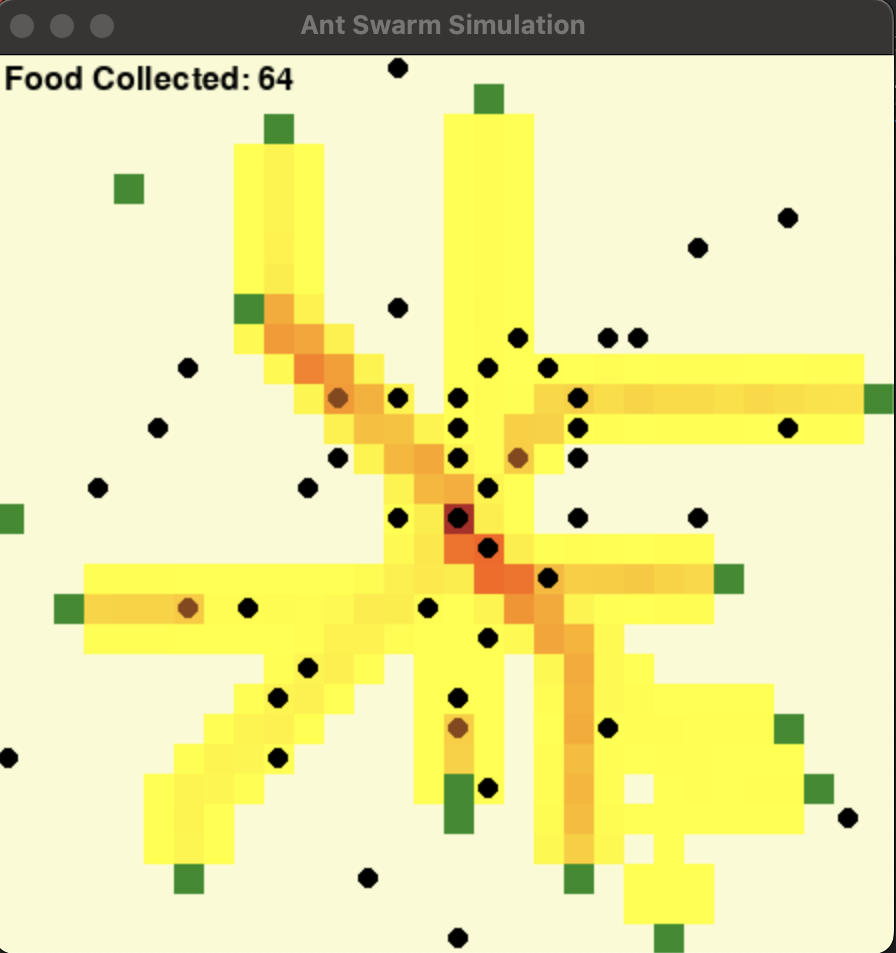

# SwarmRL: Reinforcement Learning in Swarm Intelligence

SwarmRL is a simulation project that explores the application of reinforcement learning algorithms within swarm intelligence scenarios, aiming at assessing the effectiveness of RL on multi-agent systems (MARL). It has been developed as the final project of the postgraduate’s course of Distributed Artificial Intelligence.



## Features

- **Interactive Dashboard**: Control simulations, select agent algorithms and hyperparameters, view live agent behavior, analyze training progress with live charts, and review results using a Streamlit-based dashboard.
- **Algorithm Variety**: Includes Q-Learning and SARSA reinforcement learning algorithms.
- **Agent Persistence**: Save and load trained Q-Learning and SARSA agent models.
- **Advanced Analytics**: Comprehensive dashboard for analyzing the behavior of agents, including performance metrics (live and post-training) and visualizations of final results.
- **Extensible Framework**: Designed with modularity in mind, enabling easy integration of new algorithms and simulation scenarios.
- **Early Stopping**: Training can automatically terminate if agents consistently collect all food, saving computation time.

## Getting Started

### Prerequisites

Ensure you have Python 3.8+ installed on your system. This project relies on several key Python libraries, including:
- `numpy` for numerical operations.
- `pandas` for data manipulation (results analysis).
- `matplotlib` and `seaborn` for plotting results.
- `pygame` for the underlying simulation visualization.
- `streamlit` for the interactive dashboard.
- `Pillow` for image processing for visualization.

Install the required dependencies using pip:

```bash
pip install -r requirements.txt
```
(Note: Ensure `requirements.txt` is up-to-date with all necessary packages like `streamlit`, `Pillow`, etc.)

### Installation

1.  Clone the repository:
    ```bash
    git clone https://github.com/MicheleBellitti/SwarmRL.git
    cd SwarmRL
    ```
2.  Install dependencies:
    ```bash
    pip install -r requirements.txt
    ```

## Running the Simulation and Dashboard

### Running the Streamlit Dashboard
The primary way to interact with SwarmRL is through the Streamlit dashboard.

1.  Ensure all dependencies are installed:
    ```bash
    pip install -r requirements.txt
    ```
2.  Run the dashboard:
    ```bash
    streamlit run dashboard.py
    ```
3.  **Using the Dashboard:**
    *   **Sidebar Controls**: Use the sidebar to:
        *   Select the agent algorithm (Q-Learning or SARSA).
        *   Set the number of training episodes.
        *   Adjust core hyperparameters: learning rate (alpha), discount factor (gamma), and initial epsilon for exploration.
        *   Toggle live simulation visualization to see agents in the Pygame window.
        *   Enable/disable early stopping and configure the number of consecutive successful episodes required to trigger it.
    *   **Simulation Control**: Use the main panel buttons to start, pause, resume, or stop the training process.
    *   **Live Progress**: During training, live charts display key metrics such as cumulative reward per episode, food collected per episode, and steps per episode, providing immediate feedback on agent performance. If enabled, the live Pygame visualization will also update.
    *   **Results**: After training completes (or stops), detailed results (data tables) and summary plots (e.g., smoothed reward curves) are displayed on the dashboard.
    *   **Early Stopping**: If enabled, training will automatically stop if the agent successfully collects all food for the configured number of consecutive episodes.

### Command-Line Usage (Primarily for Inference)
While the Streamlit dashboard is recommended for training and interaction, `simulate.py` can still be used from the command line, primarily for running inference with pre-trained models:

```bash
python simulate.py --mode infer --weights_file <path_to_weights.npy> --config_index <idx>
```
-   `--mode infer`: Specifies inference mode.
-   `--weights_file <path_to_weights.npy>`: Path to the saved agent model (e.g., `weights/q_table_agent_0.npy`).
-   `--config_index <idx>`: Index of a base configuration (0-3) from `params.py` to use for environment setup. This is important to ensure the environment and agent architecture match the saved model.

For training, hyperparameter tuning, and detailed interaction, please use the Streamlit dashboard.

## Agent Configuration

Base configurations for the environment (grid size, number of ants, food sources) and default agent parameters are defined in `params.py`. These serve as starting points.

The Streamlit dashboard allows you to dynamically override key agent settings for each training run:
-   **Agent Type**: Choose between "Q-Learning" and "SARSA".
-   **Hyperparameters**: Adjust learning rate, discount factor (gamma), and initial epsilon directly in the UI.
-   **Training Episodes**: Set the total number of episodes for the training run.

This approach allows for easy experimentation with different agent setups without directly modifying the `params.py` file for each run, while `params.py` still provides a set of default, version-controlled base environment configurations and tuned parameter sets.

## Saving and Loading Agent Weights

Trained agent models (Q-tables for Q-Learning and SARSA) are automatically saved to the `weights/` directory after a training session initiated from the Streamlit dashboard. The current saving mechanism in `RLTrainer` saves to a generic `weights/q_table_agent_0.npy`.

*Self-correction & Future Work: This generic filename means new training runs will overwrite the previous model. This should be enhanced in the future to include the dynamic configuration name (e.g., `"SARSA_Ep1000_LR0.1_G0.9_E0.95.npy"`) for better organization and preservation of multiple trained models.*

To run inference using a saved model (currently `weights/q_table_agent_0.npy`), you can use the command-line interface:
```bash
python simulate.py --mode infer --weights_file weights/q_table_agent_0.npy --config_index 0
```
Ensure the `--config_index` corresponds to a configuration in `params.py` that matches the architecture of the saved agent (e.g., number of states and actions).

## Future Enhancements

-   **Algorithm Integration**: Adding support for more reinforcement learning algorithms. (Note: PPO integration was attempted but deferred due to environment limitations regarding disk space for large dependencies like PyTorch/Ray RLLib).
-   **Improved Visualization**: Enhancing the dashboard with more interactive elements and detailed analytics.
-   **Refined Model Naming & Management**: Implement a robust system for naming, saving, and loading multiple agent models based on their configurations.
-   **Community Contributions**: Opening the platform for community-driven scenarios, algorithms, and improvements.
